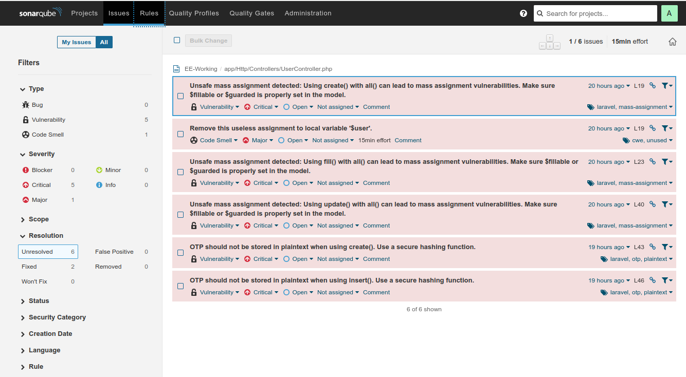

# Dự Án tạo custom rules cho SonarQube

Dự án này được tạo ra để kiểm tra và nghiên cứu các tính năng của SonarSource (SonarQube) trong việc phát hiện các lỗi bảo mật và chất lượng mã nguồn.

Cách tạo custom rules cho SonarQube để tạo thêm lỗi check mã nguồn cho SonarQube.

## Mục Tiêu

- Kiểm tra khả năng phát hiện lỗi bảo mật của SonarQube với các mẫu mã nguồn khác nhau.
- Hiểu rõ cách SonarQube phân tích và báo cáo các vấn đề bảo mật
- Cách custom rule và tạo ra các rule phù hợp với dự án của bạn.

## Hướng Dẫn Sử Dụng

### Cài đặt Java JDK.

https://bluevps.com/blog/how-to-install-java-on-ubuntu

```bash
sudo apt install openjdk-17-jdk
sudo apt install openjdk-17-jre
```

### Chạy SonarQube bằng Docker

```bash
docker-compose up -d sonarqube
```

Sau khi khởi động, truy cập SonarQube tại địa chỉ: http://localhost:9000  
(Thông tin đăng nhập mặc định: admin/admin)

### Chạy phân tích mã nguồn

Sử dụng Docker Compose để chạy trình quét (Recommend):

```bash
docker-compose up sonar-scanner
```

Hoặc chạy local (nếu tải file bin về máy host):

```
./sonar-scanner/bin/sonar-scanner -Dsonar.projectKey=app_test -Dsonar.projectName=EE-Working -Dsonar.projectVersion=1.0 -Dsonar.sources=. -Dsonar.exclusions="**/*.java" -Dsonar.login=sqp_fb748608d1a3f67ad5cbc2efbaec15dd9df5f3ec -Dsonar.projectBaseDir=/Users/ngocp/Documents/projects/sonar-check/spring-app -Dsonar.scm.disabled=true
```

Or run if have property file:

```bash
./sonar-scanner/bin/sonar-scanner -X
```

# Cách tạo thêm custom rule.
- Tạo một file Java mới trong thư mục `src/main/java/com/mycompany/rules` với tên `CustomRule.java`.
- Trong file này, bạn sẽ định nghĩa các quy tắc tùy chỉnh của mình bằng cách mở rộng các lớp và giao diện có sẵn trong SonarQube API (Có hỗ trợ nhiều lớp ngôn ngữ như PHP và Java)
- Ví dụ, bạn có thể tạo một quy tắc kiểm tra xem một biến có được khởi tạo hay không.

```java
package com.sonarsource.customrules;
import org.sonar.check.Rule;
import org.sonar.plugins.java.api.IssuableSubscriptionVisitor;
import org.sonar.plugins.java.api.tree.MethodInvocationTree;
import org.sonar.plugins.java.api.tree.Tree;

@Rule(key = "CustomRule")
public class CustomRule extends IssuableSubscriptionVisitor {

  @Override
  public List<Tree.Kind> nodesToVisit() {
    return Collections.singletonList(Tree.Kind.METHOD_INVOCATION);
  }

  @Override
  public void visitNode(Tree tree) {
    MethodInvocationTree methodInvocationTree = (MethodInvocationTree) tree;

    if (methodInvocationTree.symbol().name().equals("execute")) {
      reportIssue(methodInvocationTree, "Avoid using 'execute' method directly.");
    }
  }
}
```

- Sau khi đã tạo xong custom rule, bạn cần biên dịch lại plugin và khởi động lại SonarQube để áp dụng các thay đổi.

- Chạy script sau để build plugin, đưa vào folder plugin của sonarqube server, restart server để nhận diện plugin mới.

```bash
./rebuild.sh
```

- Vào page sau để active rule http://localhost:9000/coding_rules?selected=css%3AS4655
- Bạn cần cấu hình lại Quality Profile (extend Sonar default) và active thêm rule custom của mình.


## Kết Quả

Sau khi phân tích hoàn tất, bạn có thể xem kết quả và các vấn đề phát hiện được trong giao diện web của SonarQube.




